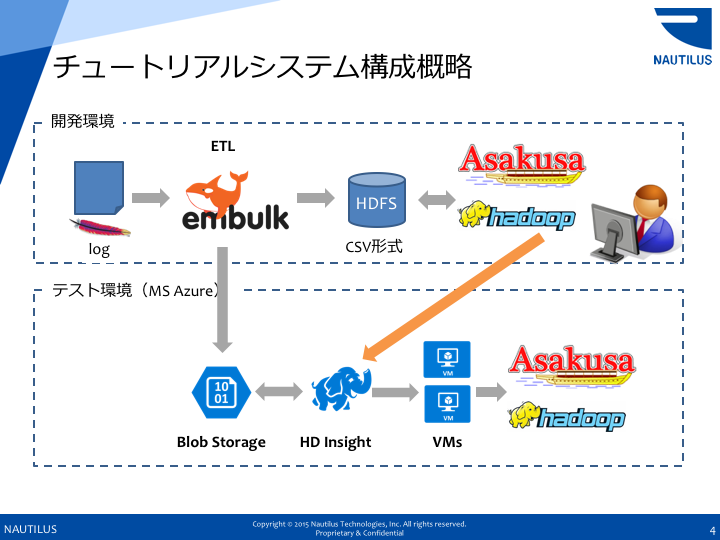

# Asakusa on Spark Apache Logファイル解析サンプル

このサンプルは、[Asakusa Framework](http://www.asakusafw.com/) で
Apacheのログファイルを解析するサンプルです。

本リポジトリにはデータは付属していません。ご自身でご用意いただくか、
[WorldCup98](http://ita.ee.lbl.gov/html/contrib/WorldCup.html) などのデータをご利用ください。
データは `apache` ディレクトリ以下に保存してください。

## 利用環境

本サンプルはOSX/Linuxにて実行を確認しています。

本サンプルの実行には、hadoop + sparkの実行環境が必要です。
(ローカル実行環境の構築は、sparkドキュメントや、[Blog記事](http://qiita.com/bohnen/items/aaf60107c12bcad44645) などを
参照ください。

Apacheログファイルから、CSVへの変換に、[Embulk](https://github.com/embulk/embulk) を利用しています。

## クラスタでの実行

本サンプルは[Microsoft Azure](https://azure.microsoft.com/ja-jp/) の、[HDInsight](https://azure.microsoft.com/ja-jp/services/hdinsight/) で
実行を確認しています。ご自身で用意したsparkクラスタ、もしくは[Amazon EMR](https://docs.aws.amazon.com/ja_jp/ElasticMapReduce/latest/DeveloperGuide/emr-what-is-emr.html) での実行も可能と思われます。

## ファイルの準備

1. `embulk run apache.yml` embulkを使って、ApacheログファイルをCSVにします。
2. ホームディレクトリで下記を行います
  * `hadoop fs -mkdir target/testing/directio/logfiles`
  * (ディレクトリを戻って) `mv ./logfiles ~/target/testing/directio/`

## 実行手順

ローカル環境での実行手順を記載します。クラスタ（クラウド）環境での実行については、各サービスのマニュアルをご参照ください。

1. `gradlew sparkCompileBatchApps` Spark用にソースファイルをコンパイルします。
2. `cp -rp build/spark-batchapps/spark.example.log $ASAKUSA_HOME/batchapps` 
3. `$ASAKUSA_HOME/yaess/bin/yaess-batch.sh spark.example.log` YAESSによりアプリケーションを起動します。

## 確認
`$HOME/target/testing/directio/logsummaries` にステータスコード 200のログファイルの集計が、
`$HOME/target/testing/directio/urlsummaries` にステータスコード 200以外の集計結果が出ています。

